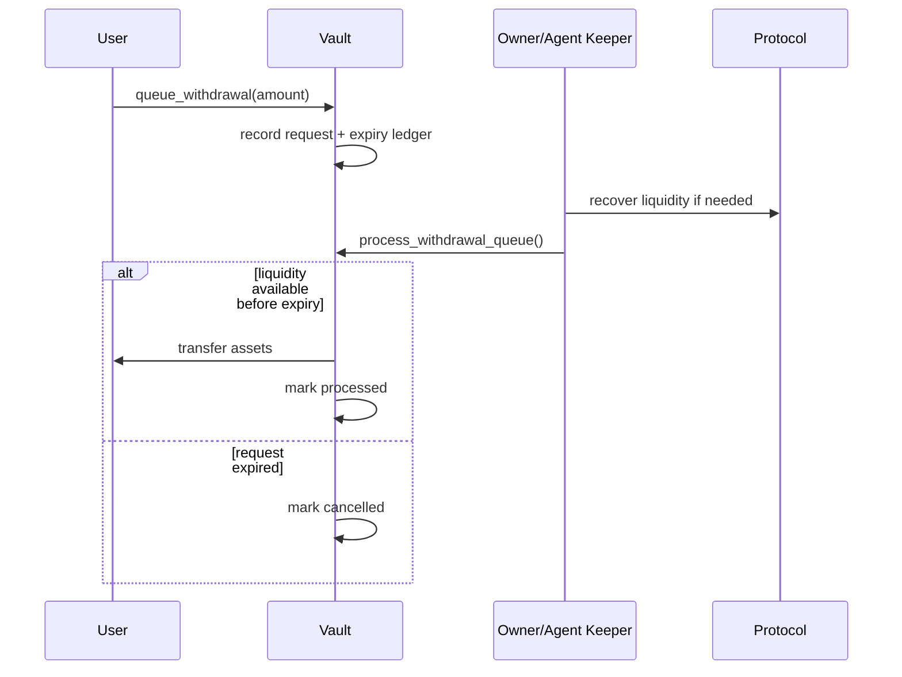

# Withdrawal Queue Operations

The vault includes a withdrawal queue for cases where a user requests liquidity that cannot be fully satisfied immediately from idle funds and current protocol liquidity. This document describes the expected operator model, TTL behavior, keeper requirements, and storage implications so users, agents, and maintainers can reason about queued withdrawals without reading contract code first.

## Flow

1. A user requests a withdrawal through the normal user-facing flow.
2. If the vault can satisfy the request immediately, the direct withdrawal path should complete without entering the queue.
3. If liquidity is constrained, the request can be queued with the requested amount, user address, creation ledger, and expiry configuration.
4. An authorized keeper path processes queued requests once idle liquidity or protocol withdrawals make enough assets available.
5. If the TTL elapses before processing, the request is marked cancelled and the user must submit a fresh withdrawal request.

## TTL Semantics

| State | Trigger | User outcome | Operator note |
| --- | --- | --- | --- |
| `pending` | Request is queued and expiry has not elapsed | User waits for keeper processing | Watch liquidity, queue depth, and oldest request age |
| `processed` | Keeper processes the request before TTL expiry | User receives the queued withdrawal amount | Emit/index the processed state for support visibility |
| `cancelled` | TTL elapses or user/admin cancellation path runs | User receives nothing from that request and must retry | The cancellation should be visible so support can explain it |

Expired requests are not the same as completed withdrawals. Operators should treat expiry as a missed service-level objective and investigate whether keepers were offline, liquidity was unavailable, or queue configuration is too strict.

## Keeper and Authorization Matrix

| Action | Expected caller | Why |
| --- | --- | --- |
| Queue a withdrawal | User | The request represents the user's own shares/assets |
| Process queue entries | Owner or agent keeper | Processing may require protocol liquidity coordination and should not be open to arbitrary callers unless the implementation is explicitly hardened for that |
| Cancel own request | User | Lets users abandon stale requests before expiry |
| Tune queue config | Owner | TTL and processing limits are risk parameters |
| Monitor queue depth | Anyone/indexer | Read-only visibility should be safe and useful for alerting |

If operators go offline, pending requests can sit until TTL expiry. Production deployments should run at least one monitored keeper and alert on both missed processing windows and a growing queue depth.

## Interaction Notes

- `set_min_withdrawal` should be documented beside queue configuration because it decides which requests are large enough to enter or remain in the withdrawal path.
- `get_user_realized_apy` and related user reporting should distinguish pending queued withdrawals from assets that have already left the vault.
- Queue processing should be considered part of withdrawal operations in monitoring, not a background optimization.
- User-facing interfaces should show queued, processed, and cancelled states separately.

## Storage and Rent

Queued withdrawal records consume storage. If processed or cancelled entries are never pruned, the queue becomes an unbounded historical ledger rather than an operational queue. That has two consequences:

- Rent/storage cost can grow with every request, including requests that expired without payout.
- Indexers and support tools need to filter active requests instead of assuming every queue record still needs action.

Until pruning exists, operators should track total entries, active pending entries, cancelled entries, and processed entries separately. Any future pruning migration should preserve enough event history for users to prove whether a request was processed or expired.

## Operational Checklist

- Confirm queue TTL and processing limits before mainnet deployment.
- Run a monitored keeper for `process_withdrawal_queue`.
- Alert when the oldest pending request approaches the TTL boundary.
- Alert when cancelled requests spike.
- Include queue status in user support tooling.
- Reconcile queue events against protocol liquidity incidents.
- Document any known owner-only processing limitation before enabling the feature for users.